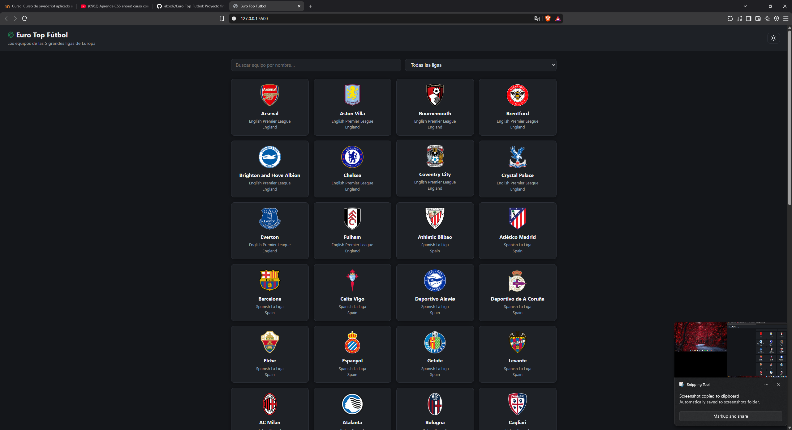

# Nombre del Proyecto = Euro_Top_Futbol
Proyecto final del curso de JavaScript

# Que API usaste y porque la elegiste?
Use la API de futbol que se nos proveyó del propio pdf del proyecto final (https://www.thesportsdb.com/documentation), 
elegi esta API porque me gusta mucho el fútbol y me parecio interesante hacer el proyecto final sobre eso.
Aclaro que la API es publica asi que no usare ninguna API key. Y la api publica esta limitada, solo devuelve
los 10 primeros equipos de cada liga en orden alfabetico.

# Que backend de coleccion use?
Use json-server, para poder levantarlo primero hay que instalar node en la computadora, luego instalar
json server desde la consola o terminal y ejecutar este comando: npm install -g json-server, luego se
debe crear un arhivo llamado db.json que en este caso ya esta creado y va a servir para almacenar los datos
de equipos favoritos, por ultimo se debe iniciar el servidor estando dentro del archivo (db.json), se
debe abir la terminal y ejecutar este comando: json-server --watch db.json
El servidor se ejecutara en una direccion local que por defecto suele ser: http://localhost:3000

# Como correr el proyecto
Como primer paso obviamente seria tener json server ya instalado, luego se debe iniciar el servidor de forma
local, en mi caso utilice la extension llamada "live server". Una vez descargado debe aparecer un boton abajo
a la derecha que debe decir "Go Live", antes de levantar el servidor primero se debe levantar el json server
con el comando de arriba, una vez levantado le damos al boton "Go live" y ya directo nos deberia de aparecer
la aplicacion corriendo en el navegador

# Que fue lo mas dificil y como lo resolvi
Antes de decir lo que mas me costo me gustaria decir como resolvi cada parte de la aplicacion. Primero no sabia
bien por donde empezar y tampoco sabia mucho sobre la arquitectura de una aplicacion, investigue sobre las funciones
que debia cumplir cada archivo, y pequeños ejemplos sencillos de como empezar cada archivo, luego fui modelando cada
parte de acuerdo al tema que elegi.
Sin duda lo que mas sencillo y que mas me gusto hacer fue la carpeta de api, ya me fue mucho mas facil el manejo de errores,
errores personalizados, los metodos HTTP, etc... En general me gusto bastante hacer esa parte.
En cuanto a la carpeta de utils y state.js bastante sencillo tambien, pequeños complementos.
Ahora si, lo que mas costo sin duda fue la carpeta de ui y el main.js, sinceramente no tenia nada de experiencia en el tema de 
interfaz, tuve que ver un video en yt y que claude me explique varias cosas que no entendia, lo mismo con el style.css. Aprendi
bastante pero aun me faltaba un monton para poder hacer la UI solo, y tuve que pedir ayuda a claude. En cuanto al main me costo un poco
tambien pero mucho menos de lo que me costo la UI, ya que al dejar el main para lo ultimo, y ya venia entiendo mas, me fue relativamente
mucho mas sencillo hacer esa parte.
En el proyecto en general siento que me fue bastante bien, lo que me faltaria apretar mas seria con el tema de la interfaz y aprender a 
usar mejor CSS. Y decidi usar lucide para los iconos, ya que me habia aparecido en tik tok y quise usarla.
Creeria que eso es todo... Muchas gracias por todo Victor, sos muy buen profe, se te da re bien :)
PD: justo lei los comentarios que le pusiste a mis trabajos, y queria decirte que voy a estar practicando mas hasta que pueda hacer alguna
aplicacion totalmente solo. Ah si, y casi me olvidada si ves el .gitignore es porque uso gitgub para subir mis proyectitos ahi ajaj

Por si queres ver este es el repo: https://github.com/abxxl7/Euro_Top_Futbol.git